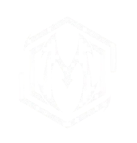

<div align="center">
  
  <h1>Modular</h1>
  <p><strong>Security and website quality, reviewed from your repository.</strong></p>
  <p>Node.js 22.12+ · MIT · No runtime dependencies</p>
</div>

Modular is a local CLI for reviewing web applications before a release. It scans source code for security risks and website quality issues, then produces reports with evidence, source locations and suggested fixes. Add a browser run when you need evidence from the rendered page.

[Install and run](#quick-start) · [Commands](#available-commands) · [Documentation](./docs/README.md) · [Türkçe](./docs/README.tr.md) · [Contribute](./CONTRIBUTING.md)

## What you can review

| Module | Areas covered |
|---|---|
| **Security** | Credential patterns, browser injection sinks, bounded server data flows, JWT configuration, transport, CI and selected container/infrastructure settings |
| **Website quality** | Accessible names and semantics, metadata, crawlability, structured data, responsive layout signals and asset delivery |
| **Optional browser audit** | Rendered DOM, Axe checks, console/network errors, response headers and laboratory LCP/CLS |

Static scans run without an AI model, API key or network service. Source code is read as data and is never modified by a scan. Dependency advisories and browser execution are separate opt-ins.

Modular accepts supported **website projects**, including monorepos with a web application and backend. A standalone CLI, backend-only service or native app does not pass the website gate. Detection supports static HTML and common JavaScript frameworks; see [coverage and limitations](./docs/coverage.md) for the boundaries.

## Quick start

Modular can be installed directly from this GitHub repository. **An npm registry release is not required:** npm can build and install a package from the downloaded source. This is a Node.js CLI, not a standalone `.exe`; Node.js must remain installed to run it.

### 1. Check the requirements

Install **Node.js 22.12 or newer**, with npm, then open a terminal:

```console
node --version
npm --version
```

Git is optional: use it to clone the repository, or download a ZIP as described below. Static scans need no AI account, API key, website dependency installation, build or running web server.

### 2. Download Modular

With Git:

```console
git clone https://github.com/manyZXZ/modular-cli.git
cd modular-cli
```

Without Git, open [manyZXZ/modular-cli](https://github.com/manyZXZ/modular-cli), choose **Code → Download ZIP**, extract it, and open a terminal in the extracted folder containing `package.json`. Use that folder for the next step; its name may differ from `modular-cli`.

### 3. Install the `modular` command

From the downloaded Modular folder:

```console
npm pack --ignore-scripts
npm install --global ./modular-check-0.1.0.tgz
modular --version
```

Use the archive filename printed by `npm pack` if the version differs. The `./` path tells npm to install the local file, not look up Modular by package name in the registry. You do not need to run `npm install` in the source folder first for this static CLI installation.

The global installation is shared across your website projects; do not repeat it in every repository. The command is available wherever your shell can find npm's global executable directory. Unlike `npm link`, installing the archive does not depend on keeping the original source folder in place. See [command troubleshooting](#if-your-terminal-cannot-find-modular) if the version command fails.

### 4. Scan your website

Open a terminal in **your website's source folder**, or change into it:

```console
cd "path/to/your/website"
modular doctor
modular check all --json --sarif
```

Replace the example path with your actual website directory. `doctor` checks local static-scan readiness without creating reports. `check all` runs both scanners and writes reports into that website's `Modular/` folder; `--json` and `--sarif` add machine-readable outputs.

You can also stay in another directory and select the website explicitly:

```console
modular check all --root "path/to/your/website" --json --sarif
```

On Windows, quote paths containing spaces, for example `--root "D:\Projects\My Website"`. Modular's own source folder is a CLI project, not a website: scan your web project or the included demo instead. The `check` commands reject unsupported non-website targets with exit code `2`.

### Try it without installing a global command

From the downloaded Modular folder:

```console
node bin/modular.js --version
npm run demo
```

The [demo](./examples/README.md) scans a small, deliberately incomplete website. Open `examples/basic-site/Modular/00-overview.md` to see its results. No dependency installation is needed for this static scan.

To scan your own project directly from the source:

```console
node bin/modular.js check all --root "path/to/your/website" --json --sarif
```

For development, `npm link` is an alternative to installing the archive: run it in the Modular folder to connect the `modular` command to that checkout. Keep the linked folder in place. Changes to that checkout are used by the linked command; an archive installation stays at the installed version until you install another archive.

### If your terminal cannot find `modular`

- Reopen the terminal after setting up Node.js or changing `PATH`, then try `modular --version` again.
- Ensure npm's global executable directory is on `PATH`. `npm prefix --global` shows the global prefix: the command is placed directly there on Windows, or in its `bin/` subdirectory on Linux/macOS.
- If Windows PowerShell blocks a generated `.ps1` launcher, use `npm.cmd` for the npm commands and `modular.cmd --help` or `modular.cmd check all` for Modular. You do not need to relax the system execution policy.
- If you cannot use a global installation, run `node bin/modular.js check all --root "path/to/your/website"` from the downloaded Modular folder.

[Installation, Windows paths and local archives →](./docs/getting-started.md)

## Available commands

After installation, run these from a website folder or add `--root "path/to/site"`:

| Command | Purpose |
|---|---|
| `modular check security` | Inspect application security, credential patterns and selected supply-chain/configuration risks |
| `modular check mysite` | Inspect website accessibility, SEO, responsive-layout and other site-quality signals |
| `modular check all` | Run both scanners with one repository discovery |
| `modular doctor` | Check local static-scan readiness without running audits or writing reports |
| `modular --help` | Show all supported commands and options |
| `modular --version` | Show the installed version |

All three `check` commands require a supported website project. `--help` and `--version` work without a website. Default scans are static: they do not start a browser or query a dependency registry. `--dependency-audit` explicitly enables the supported network advisory lookup for `security`/`all`; `--runtime` enables browser auditing for `mysite`/`all` and requires separate [Playwright/Axe setup and a target](./docs/runtime.md).

## From a finding to a fix

The demo's email field produces this finding:

```text
a11y-form-label · high · index.html:14
Form control has no programmatic label
```

The detailed report explains the evidence and recommends associating a visible label with the control. Review the evidence, fix the relevant source, then rerun the same command. Modular does not apply fixes automatically.

Each run writes an overview and the selected module's report/action plan. A combined scan produces:

```text
Modular/
├── 00-overview.md
├── 01-security-report.md
├── 02-security-action-plan.md
├── 03-site-report.md
├── 04-site-action-plan.md
├── modular-results.json       # with --json
└── modular-results.sarif      # with --sarif
```

Findings carry severity, confidence and a manual-review flag. A completed scan means the requested work finished; it does not certify that the site is secure or accessible. The score helps prioritize review, and is not a measured accuracy percentage. [Learn how to read the results.](./docs/reports.md)

## Use it in your workflow

After linking or installing the local package:

```console
modular check security --root "path/to/site"
modular check mysite --root "path/to/site"
modular check all --root "path/to/site" --fail-on high --json --sarif
modular doctor --root "path/to/site"
```

Scans are advisory by default. `--fail-on high` returns exit code `3` when an unsuppressed high or critical finding is present. A reviewed baseline lets you gate only new findings or severity regressions. [Configure a project policy](./docs/configuration.md) or [add a CI job](./docs/ci.md).

For an existing build and a trusted Playwright installation:

```console
modular check mysite --root "path/to/site" --runtime --runtime-static-dir dist --runtime-spa-fallback
```

Runtime setup, browser selection and the difference between a static preview and a deployed application are covered in the [browser audit guide](./docs/runtime.md).

## Documentation

- [Getting started](./docs/getting-started.md) — installation and your first real scan.
- [CLI reference](./docs/cli.md) — commands, options, defaults and exit codes.
- [Configuration](./docs/configuration.md) — project policy, baselines and suppressions.
- [Reports](./docs/reports.md) — evidence, scores, coverage and machine output.
- [Coverage](./docs/coverage.md) — supported inputs, privacy and analysis limits.
- [Browser audits](./docs/runtime.md), [CI](./docs/ci.md), [troubleshooting](./docs/troubleshooting.md) and [JavaScript API](./docs/api.md).

## Development

```console
npm ci --ignore-scripts
npm run release:check
```

The release gate checks the public file set, tests, TypeScript API, CLI, archive contents and an offline installation. Real Chromium/Axe integration runs separately in CI; see [Contributing](./CONTRIBUTING.md) for the local command.

Found a scanner error? Include a small, synthetic reproduction. Report confidential security issues through the process in [SECURITY.md](./SECURITY.md).

[Changelog](./CHANGELOG.md) · [Release process](./RELEASING.md) · [Code of conduct](./CODE_OF_CONDUCT.md) · [MIT license](./LICENSE)
